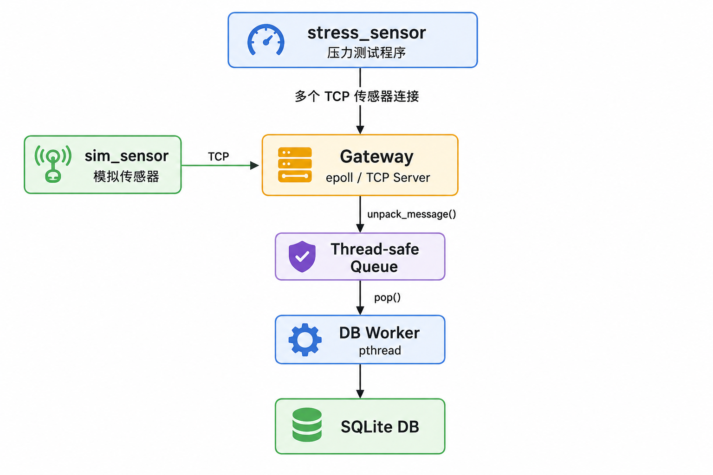
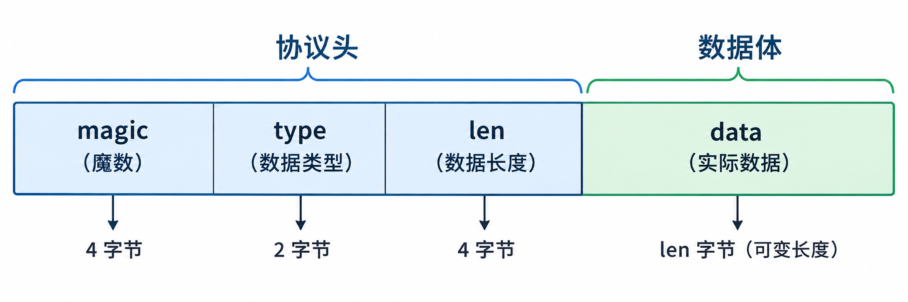
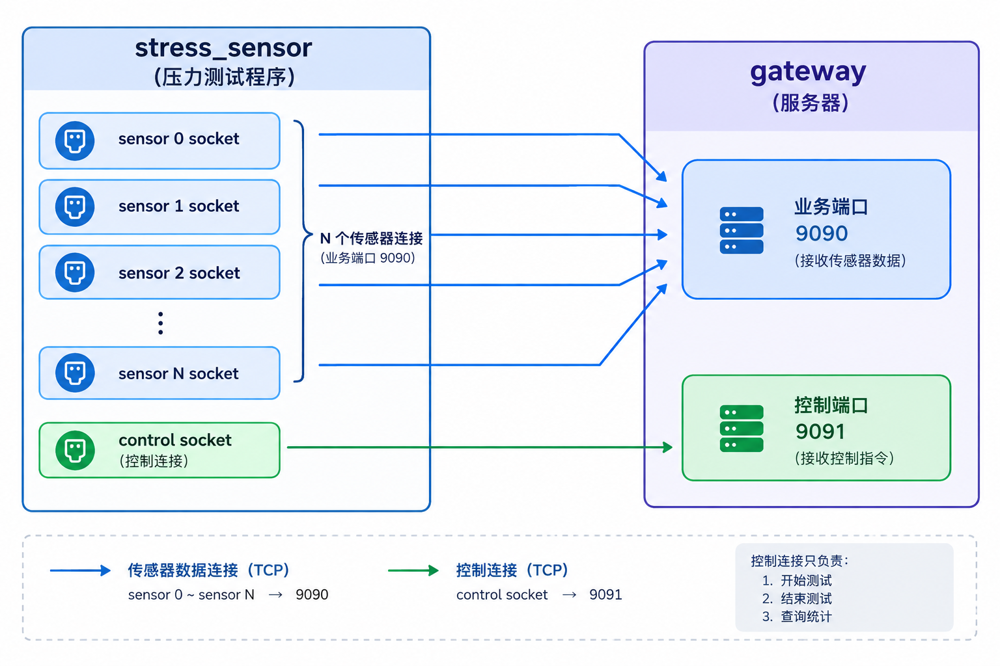
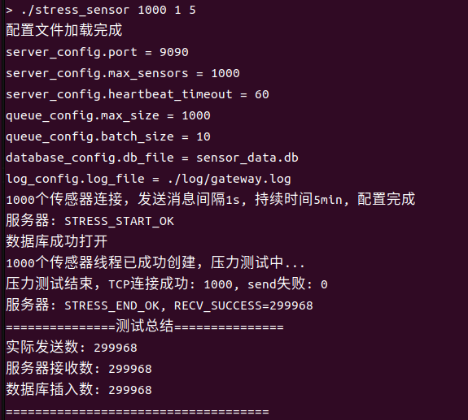

# sensor_gateway

一个基于 **C / Linux / TCP / epoll / pthread / SQLite** 实现的传感器网关项目。

项目主要用于学习和实践：

- TCP 网络编程
- `epoll` 边缘触发（ET）
- TCP 粘包/拆包处理
- 自定义二进制协议
- 多线程生产者/消费者模型
- pthread 线程同步
- SQLite 数据库存储
- 模拟传感器与压力测试

---

## 1. 项目功能

网关程序主要完成以下工作：

1. 监听 TCP 端口，接受传感器连接。
2. 使用 `epoll` 管理多个传感器连接。
3. 接收传感器发送的协议数据，并保存到每个传感器自己的接收缓冲区。
4. 根据协议头中的长度字段进行完整协议包解析，处理 TCP 粘包和拆包。
5. 支持传感器数据上传、数据查询、心跳延长等消息类型。
6. 通过线程安全队列把接收到的传感器数据交给数据库工作线程。
7. 批量写入 SQLite 数据库。
8. 提供模拟传感器程序，用于功能测试。
9. 提供压力测试程序，用于测试并发连接、消息发送、服务器接收和数据库写入能力。

---

## 2. 系统架构

整体数据流如下：




### 网络线程

网关主线程负责：

```text
accept
  -> epoll
  -> recv
  -> 接收缓冲区
  -> unpack_message(解包提取)
  -> 根据消息类型处理
  -> push(queue)
```

### 数据库工作线程

数据库线程负责：

```text
pop(queue)
  -> 批量获取消息
  -> SQLite INSERT
```

项目当前采用生产者/消费者模型：网络线程负责生产数据，数据库工作线程负责消费数据

---

## 3. 项目目录

```text
sensor_gateway/
├── config/
│   └── gateway.conf          # 网关配置文件
│
├── include/
│   ├── config.h
│   ├── database.h
│   ├── log.h
│   ├── protocol.h
│   ├── queue.h
│   ├── server.h
│   ├── stress_control.h
│   ├── thread.h
│   └── utils.h
│
├── log/
│    └── gateway.log    
│
├── src/
│   ├── config.c              # 配置文件解析
│   ├── database.c            # SQLite 数据库操作
│   ├── log.c                 # 日志功能
│   ├── main.c                # 程序入口
│   ├── queue.c               # 线程安全队列
│   ├── server.c              # TCP + epoll 服务器
│   ├── thread.c              # 数据库工作线程
│   └── utils.c               # 工具函数
│
├── build/                    # CMake 编译输出
│
├── tools/
│   ├── sim/
│   │   ├── compile_sim.sh    # 模拟传感器编译脚本
│   │   └── sim_sensor.c      # 单个模拟传感器
│   │
│   └── stress/
│       ├── compile_stress.sh # 压力测试编译脚本
│       └── stress_sensor.c   # 多传感器压力测试程序
|
├── compile_gateway.sh                # 网关编译脚本
├── CMakeLists.txt
└── README.md
```

---

## 4. 配置文件

配置文件：

```text
config/gateway.conf
```

示例：

```ini
port=9090
max_sensors=1000
heartbeat_timeout=60
queue_max_size=1000
batch_size=10
db_file=sensor_data.db
log_file=./log/gateway.log
```

其中比较重要的参数：

### `port`

网关监听端口。

例如：

```text
9090
```

### `max_sensors`

允许的最大传感器连接数量

### `heartbeat_timeout`

传感器超过该时间没有操作时，服务器会主动断开连接

### `queue_max_size`

消息队列最大容量

如果生产速度长期高于消费速度，队列可能逐渐增长并最终达到上限

### `batch_size`

数据库线程一次批量处理的数据量

---

## 5. TCP 粘包和拆包处理

TCP 是字节流协议，`send()` 的次数和 `recv()` 的次数没有一一对应关系
- 传感器发送数据`Temp:25,Hum:60` 和 `Temp:26,Hum:61`
- 网关服务器可能一次 recv 收到 `Temp:25,Hum:60Temp:26,Hum:61`（粘在一起），也可能只收到 `Temp:25,Hum:6`（被拆开）

因此设计了**定长头 + 变长体**的数据包结构



---

## 6. 编译
### 6.1 编译网关
```bash
# 进入项目目录
cd sensor_gateway/

# 执行编译网关脚本
bash compile_gateway.sh
```

### 6.2 编译模拟传感器
```bash
# 进入项目工具包下的模拟传感器目录
cd sensor_gateway/tools/sim/

# 执行模拟传感器编译脚本
bash compile_sim.sh
```

### 6.3 编译压力测试程序
```bash
# 进入项目工具包下的压力测试目录
cd sensor_gateway/tools/stress/

# 执行压力测试的编译脚本
bash compile_stress.sh
```

---

## 7. 启动
⚠️**注意**：必须先启动网关，再进行模拟传感器的连接和压力测试。模拟传感器连接和压力测试相互独立不能同时运行，避免干扰压力测试结果

### 7.1 启动网关
开启一个终端:
```bash
# 保证在项目的根目录下
cd sensor_gateway/

# 启动网关程序
./build/bin/gateway
```

### 7.2 启动模拟传感器

用于模拟一个真实传感器客户端，与网关建立 TCP 连接。下面是操作步骤：

在启动网关后，另外开启一个新的终端:
```bash
# 进入项目工具包下的模拟传感器目录
cd sensor_gateway/tools/sim/

# 启动程序
./sim_sensor
```
连接成功后，会收到网关发来的反馈：`您已成功与服务器连接!`
接下来可以发送不同类型的协议消息

#### 7.2.1 上传数据
向网关上传传感器温度`Temp`和湿度`Hum`数据，随后由网关将数据写入`SQLite`数据库
命令格式:
```bash
Temp:xx.xx, Hum:xx.xx
```
例如：
```bash
# 温度为12.3℃， 湿度为45.6%
Temp:12.3, Hum:45.6
```

#### 7.2.2 查询数据
向网关发送`get_data`指令，网关会将`SQLite`数据库里的传感器数据返回:
返回的数据格式：
| 主键id | 上传时间 | 温度 | 湿度


#### 7.2.3 延长心跳时间
一般心跳时间为配置文件中的`heartbeat_timeout`, 传感器连接网关后长时间无操作，超过心跳时间网关会自动与该传感器断开连接

例如：
当前在配置文件`gateway.conf`中设置心跳时间`heartbeat_timeout`为60s
在60s内传感器无操作：


可以通过输入`PING`指令，将该传感器的心跳时间延长为原来的一倍(120s)，仅本次有效


### 7.3 启动压力测试
⚠️**注意**：必须保证当前无传感器连接网关，否则会影响压力测试结果

在启动网关后，另外开启一个新的终端:
```bash
# 进入项目工具包下的压力测试目录
cd sensor_gateway/tools/stress/

# 启动压力测试程序
./stress_sensor <传感器数量>  <传感器上传数据间隔(s)>  <测试时长(min)>
```

例如：
```bash
# 连接 100 台传感器， 每台传感器上传间隔 10 s, 持续 1 min
./stress_sensor 100 10 1
```
在1分钟后将会显示测试结果：


---


## 8. 网关压力测试

压力测试设计方式是：



1.有N个传感器就创建N个线程，每一个传感器线程拥有自己的 TCP 连接，端口为：9090,并按照指定时间间隔发送传感器数据。
2.单独创建一个控制线程，TCP连接端口为：9091, 负责控制测试的开始、测试的结束和测试数据的统计


压力测试结果重点观察三个指标：

```text
实际发送数
服务器接收数
数据库插入数
```

### 压力测试结果
进行了 **1000** 台传感器连接， 每隔 **1** s上传数据， 持续 **5** min的**多数量连接**，**高消息压力**的测试。



在本次测试中:

1.网关能够同时维持 **1000 个传感器 TCP 连接**，没有出现连接建立失败或发送阶段错误
2.**发送数：299968, 接收数:299968, 两者完全一致，数据接收率：100%**，传感器发送的协议消息全部被网关成功接收并完成协议解析
3.**接收数:299968，数据库插入数:299968**,在`Queue->DB Worker->SQLite`这一数据链路上没有发生数据丢失

因此，在本次测试条件下，网关能够稳定处理 **1000 个并发 TCP 连接和约 1000 条/秒的传感器数据上传压力**